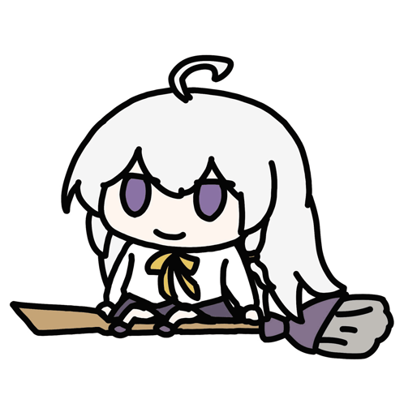

<h1>
  Hello There  
</h1>

<h3>Every Day Increased by 1 Percent.</h3>

Nama Saya Muhammad Ilyasa 😃. Saya berasal dari Bogor, Indonesia. Saya merupakan developer yang kepo banyak teknologi, tapi teknologi nya ga habis habis ~

<h6>Seseorang tidak hanya melakukan kesalahan, tetapi juga menjalani suatu pengalaman. Dari setiap pengalaman itu, kita dapat belajar dan berkembang</h6>

 

## 🦾 Technologies
* Frontend development using HTML, JavaScript, CSS, Bootstrap, jQuery, Tailwind, Vue.js, and others.
* Backend development using Laravel, Ruby on Rails, NodeJs, and Go Fiber (Still Learning).
* Design using Figma.
* Using Relational Database Management Systems.
  
 

&nbsp;&nbsp;&nbsp;&nbsp;&nbsp;&nbsp;&nbsp;&nbsp;&nbsp;&nbsp;&nbsp;&nbsp;&nbsp;  

 
 
 

## What Are You Looking For  ? 

  

Visit Counter : `count.getloli.com`

Terima kasih telah berkunjung di akunku! Sekarang bukankah   waktunya untuk kita terhubung di <strong>Linkedin</strong> ?

 
 
 
 
 
 
 
 
 
 
 
 

   
   <h1>Not Found Status 200 ok</h1>

